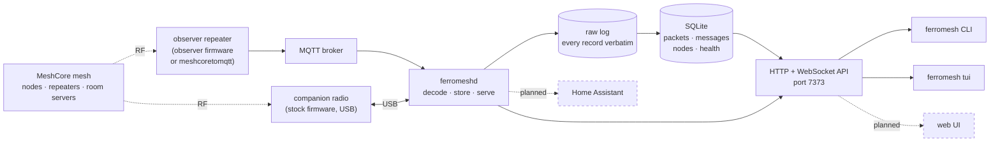

# ferromesh

Records and explores [MeshCore](https://github.com/meshcore-dev/MeshCore) mesh traffic, in Rust.

ferromesh listens to a MeshCore mesh, keeps everything it hears verbatim, decodes what it can, and stores it in SQLite. A command-line client and a terminal UI then show history, follow live traffic, raise alerts on what you care about, and send messages back through your own radio.

It listens through a **companion radio** plugged into USB, through an **MQTT broker** fed by observer repeaters, or both at once.

**Status:** early, and in daily use. Decoding, storage, the API, channel discovery, the CLI, the terminal UI, health monitoring, and sending through a companion radio all work. A web UI, a Home Assistant bridge, and radio configuration are planned; see [PLAN.md](PLAN.md).

## What it's for

A MeshCore radio shows you the messages meant for you. ferromesh keeps the rest: every packet, every reception, who heard what and how strongly, and what it all decodes to.

That makes it useful for:

- **Watching a mesh.** Every channel in one feed, with each message shown once and a count of how many radios heard it.
- **Signal and coverage work.** Every reception with its SNR, RSSI and path, so you can see which repeaters carry which traffic and how many hops it took.
- **Knowing your radios are well.** Battery, noise floor, airtime, restarts, and a check that every packet a repeater counted receiving actually reached the database.
- **History that grows backwards.** Encrypted channel traffic is stored even when nobody can read it, so adding a key later decodes everything that was waiting.
- **Messaging from a terminal, or a script.** Send to a channel or a node and watch who heard it, over the API.

## How it fits together



Everything reaching the daemon is appended to the raw log before it touches the database, so the database can always be rebuilt from scratch and checked against itself. The clients only ever talk to the API, so they run from any machine on the network.

## Ways to run it

**A radio on a USB port, and nothing else.** A spare MeshCore radio with stock companion firmware is a complete source: it reports every packet it hears with signal strength, takes direct messages addressed to it, and sends. No broker, no repeater, no infrastructure. Its view reaches as far as its antenna, and its firmware drops the largest frames, so it stores roughly 99% of what it hears.

**A broker fed by observer repeaters.** A repeater running observer firmware, or [meshcoretomqtt](https://github.com/Cisien/meshcoretomqtt) beside one, publishes everything it hears. This is the wider view — a repeater on a hill hears a whole region — and several repeaters can feed one ferromesh, which then shows each packet from every vantage point at once. Nothing is sent this way.

**Both,** which is the interesting setup: the repeaters give coverage, the companion radio gives you an identity on the mesh to send and receive messages with, and each confirms what the other heard.

## Quick start

```sh
cp ferromesh.example.toml ferromesh.toml   # pick your sources and channels
cargo run --release -p ferromeshd -- serve # the server, on port 7373

cargo install --path crates/ferromesh     # the client, here or on another machine
export FERROMESH_SERVER=localhost
ferromesh tui
```

Then [docs/running.md](docs/running.md) for the real thing: Docker, the config in full, and the radio.

## Documentation

| | |
|---|---|
| [docs/running.md](docs/running.md) | Building, Docker, every configuration option, the raw log, rebuilding |
| [docs/using.md](docs/using.md) | The CLI, the filter language, the terminal UI, sending, channels |
| [docs/companion.md](docs/companion.md) | The companion radio: flashing, contacts, what it records, troubleshooting |
| [docs/api.md](docs/api.md) | The HTTP and WebSocket API |
| [docs/development.md](docs/development.md) | Crate layout, tests, the golden fixture, protocol references |
| [PLAN.md](PLAN.md) | Design decisions, measurements, and what's next |

## License

MIT; see [LICENSE](LICENSE).
