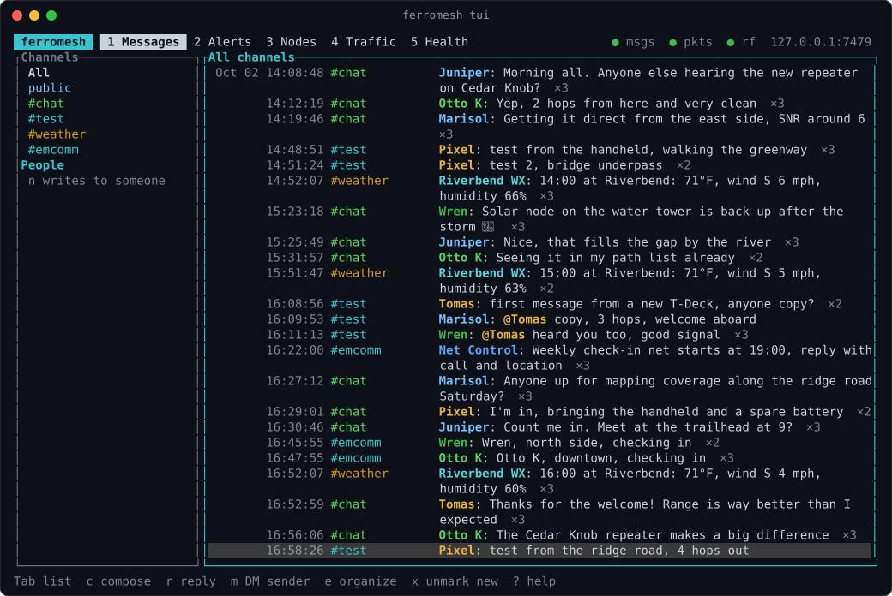
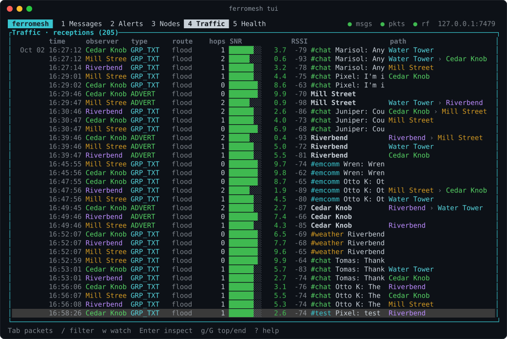
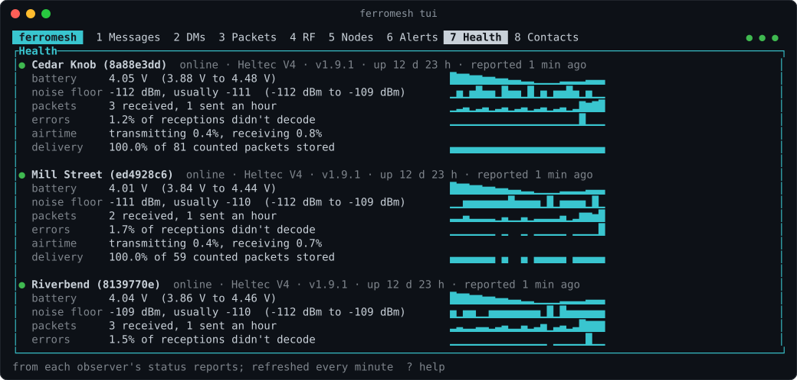
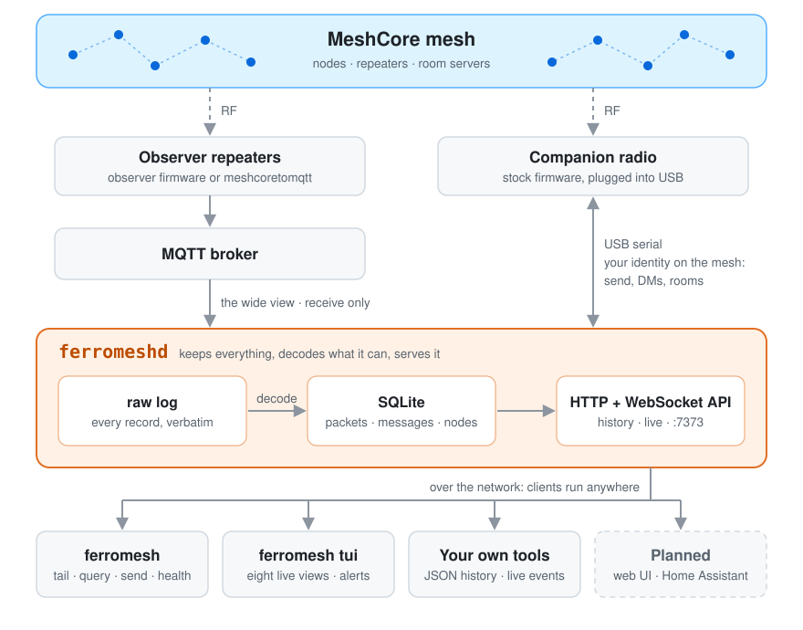

# ferromesh

[](https://github.com/swilcox/ferromesh/actions/workflows/ci.yml)
[](https://github.com/swilcox/ferromesh/actions/workflows/ci.yml)
[](https://www.rust-lang.org)
[](LICENSE)

**Record everything your [MeshCore](https://github.com/meshcore-dev/MeshCore) mesh says. Search it, watch it live, and talk back, all from a terminal.**

A MeshCore radio shows you the messages meant for you. ferromesh keeps the rest: every packet, every reception, who heard what and how strongly, and what it all decodes to. It listens through a **companion radio** on USB, through an **MQTT broker** fed by observer repeaters, or both, and serves it all to a command line and a terminal UI.



## What you can do

- **Follow every channel in one live feed.** Each message is shown once, with a count of how many radios heard it.
- **Read channels you couldn't before.** Encrypted traffic is stored even when nobody can read it. Add a key, or let `ferromesh channels guess` find hashtag channels, and the history that was waiting decodes.
- **Search the history.** One filter language covers sender, channel, text, packet type, signal and hop count, in the CLI, the TUI and alerts alike: `ferromesh query from:BNA* storm --since 6h`.
- **See signal and coverage.** Every reception carries its SNR, RSSI and path, with repeaters named along the route. Open any packet to see it from every radio that heard it, its bytes labelled field by field.
- **Message from the terminal.** Send to channels and nodes, keep DM conversations, post to room servers, and see who heard your message or whether it was acknowledged.
- **Get alerted.** Save any filter as a watch. Matching traffic is highlighted, rings the bell, and lands in the Alerts tab.
- **Know your radios are well.** Battery, noise floor, airtime and restarts over time, plus a check that every packet a repeater counted actually reached the database.
- **Build on it.** An HTTP API for history and a WebSocket stream that resumes where it left off, JSON throughout.
- **Never lose anything.** Every record is appended verbatim to a raw log before it touches the database, so the database can always be rebuilt and checked against it.

<details>
<summary>More of the terminal UI</summary>

Traffic: every reception, with signal strength and the repeaters it came through:



Each observer's health, with a day of hourly trends:



</details>

**Status:** early, and in daily use. Everything above works. A web UI, a Home Assistant bridge and radio configuration are planned; see [PLAN.md](PLAN.md).

## How it fits together

<picture>
  <source media="(prefers-color-scheme: dark)" srcset="docs/architecture-dark.svg">
  
</picture>

The clients only ever talk to the API, so they run from any machine on the network.

## Ways to run it

**A radio on a USB port, and nothing else.** A spare MeshCore radio with stock companion firmware is a complete source: it reports every packet it hears with signal strength, takes direct messages addressed to it, and sends. No broker, no repeater, no infrastructure. Its view reaches as far as its antenna, and its firmware drops the largest frames, so it stores roughly 99% of what it hears.

**A broker fed by observer repeaters.** A repeater running observer firmware, or [meshcoretomqtt](https://github.com/Cisien/meshcoretomqtt) beside one, publishes everything it hears. This is the wider view — a repeater on a hill hears a whole region — and several repeaters can feed one ferromesh, which then shows each packet from every vantage point at once. Nothing is sent this way.

**Both,** which is the interesting setup: the repeaters give coverage, the companion radio gives you an identity on the mesh to send and receive messages with, and each confirms what the other heard.

## Quick start

```sh
cp ferromesh.example.toml ferromesh.toml   # pick your sources and channels
cargo run --release -p ferromeshd -- serve # the server, on port 7373

cargo install --path crates/ferromesh     # the client, here or on another machine
export FERROMESH_SERVER=localhost
ferromesh tui
```

Then [docs/running.md](docs/running.md) for the real thing: Docker, the config in full, and the radio.

## Documentation

| | |
|---|---|
| [docs/running.md](docs/running.md) | Building, Docker, every configuration option, the raw log, rebuilding |
| [docs/using.md](docs/using.md) | The CLI, the filter language, the terminal UI, sending, channels |
| [docs/companion.md](docs/companion.md) | The companion radio: flashing, contacts, what it records, troubleshooting |
| [docs/api.md](docs/api.md) | The HTTP and WebSocket API |
| [docs/development.md](docs/development.md) | Crate layout, tests, the golden fixture, protocol references |
| [PLAN.md](PLAN.md) | Design decisions, measurements, and what's next |

## License

MIT; see [LICENSE](LICENSE).
